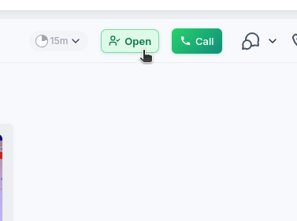
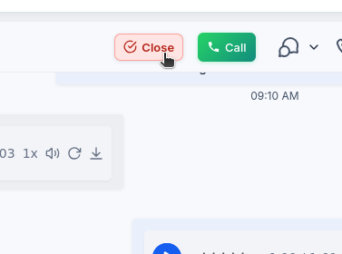

# Buttons for the GHL CRM

A community project that adds an **Open / Close / Closed** control to the Conversations header in the GHL CRM. It helps agents take ownership of a conversation and manage its state through the CRM's native owner and tag controls.

> This is an independent project with no official affiliation with GHL.

## Preview

| Open | Close |
| :---: | :---: |
|  |  |

## How it works

The button reflects the state confirmed by the contact's tags:

- No `open` or `closed` tag: **Open**.
- `open` without `closed`: **Close**.
- Any confirmed `closed` tag: **Closed**, with no further automated action.

When you click **Open**, the script independently attempts to:

1. Assign the conversation to the currently signed-in user.
2. Add the `open` tag.

If one action fails, the other can still succeed. If the owner is assigned but the tag fails, the button remains **Open** and you can retry. If the tag succeeds but owner assignment fails, the button moves to **Close** and the owner may need to be corrected manually.

When you click **Close**, the script adds the `closed` tag while preserving the `open` tag, all other tags, and the current owner. For safety, closing is attempted only when the `open` tag is already confirmed.

The script supports both the current tag-selection modal and the legacy dropdown menu. It also revalidates the active conversation throughout each operation to reduce the risk of changing the wrong contact during in-app navigation.

## Requirements

- Create the tags `open` and `closed` in every subaccount, using these exact lowercase names.
- Make sure each user has permission to change the conversation owner and tags.
- Test the initial installation and every update on an authorized test contact first.

## Installation

Add this single line to the account's custom code field:

```html
<script src="https://cdn.jsdelivr.net/gh/hubglobalsolutionscom-rgb/botoes-crm-ghl@main/ghl-conversation-control.js" async crossorigin="anonymous" referrerpolicy="no-referrer"></script>
```

Add the line only once. The `@main` reference receives updates published to this repository after the CDN cache refreshes.

For full control over updates, fork this repository and replace `hubglobalsolutionscom-rgb/botoes-crm-ghl` with `YOUR-USERNAME/YOUR-REPOSITORY`. To pin a specific version, replace `@main` with a release tag such as `@v1.3.0`.

If the field accepts JavaScript only, use:

```javascript
(()=>{const s=document.createElement("script");s.src="https://cdn.jsdelivr.net/gh/hubglobalsolutionscom-rgb/botoes-crm-ghl@main/ghl-conversation-control.js";s.async=true;s.crossOrigin="anonymous";s.referrerPolicy="no-referrer";document.head.appendChild(s)})();
```

## Security and privacy

- The published source contains no tokens, passwords, cookies, API keys, subaccount IDs, or contact data.
- The script has no project-owned telemetry, backend, or direct network API calls. The browser still downloads the file from the CDN, and the CRM's native interface persists the requested actions.
- Changes are made through the interface already open in the browser, using the signed-in user's existing session and permissions.
- Custom code runs with the privileges of the active session. Using `@main` also means trusting future repository updates; use your own fork or a pinned release if you need independent control.
- Never add credentials or private identifiers to the source. Do not post screenshots containing real data in Issues or Pull Requests.
- Review and test every update before production use. The CRM interface is not a stable public API and may change.

Read [SECURITY.md](SECURITY.md) before reporting a potential vulnerability.

## Contributing

Improvements are welcome. Read [CONTRIBUTING.md](CONTRIBUTING.md), run `npm test`, and open a Pull Request without real account or contact data.

## Support the project

Anyone who would like to support project maintenance can make a symbolic contribution of **R$ 18** or donate in USD.

- [Contribute R$ 18 with Pix](https://buy.stripe.com/5kQbJ1dm1eDLgAFcq504803)
- [Donate in USD](https://donate.stripe.com/7sYdR91Dj9jr1FL9dT04802)

Contributions are optional and do not affect access to the source code.

## License

Distributed under the MIT License. See [LICENSE](LICENSE).
